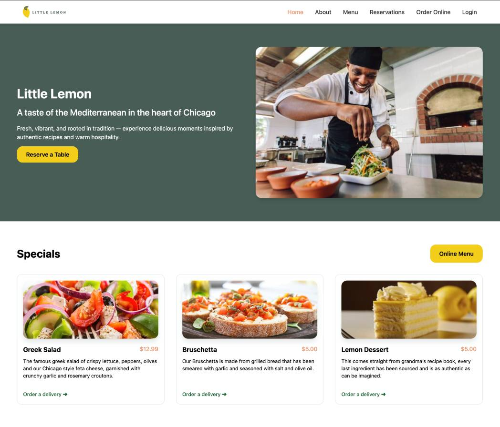

# 🍋 Little Lemon Booking App



A responsive React-based reservation system for the Little Lemon restaurant, developed as part of the Meta Front-End Developer Capstone project.

## Pages

- ```/``` — Home
- ```/about``` — About
- ```/menu``` — Menu
- ```/reservations``` — Booking Form
- ```/booking-confirmed``` — Confirmation screen
- ```/order-online``` — Online Ordering
- ```/login``` — Login Page

- ```*``` — 404 Not Found fallback route

## Booking Form

Built with Formik and Yup for state management and validation

### Validates:

- Name (required)
- Date (must be in the future)
- Time (required)
- Guests (minimum 1)
- Dynamic time slot availability using fetchAPI(date)
- Handles booking submission via submitAPI(formData)
- Booking times fetched and managed using useReducer
- Real-time updates when changing the date

## API Integration

- ```fetchAPI(date)``` to retrieve available time slots
- ```submitAPI(formData)``` to simulate booking submission

## Testing

Unit tests with React Testing Library:
- Booking form renders correctly
- ```initializeTimes()``` and `updateTimes()` behave as expected

## Available Scripts

In the project directory, you can run:

### `npm start`

Runs the app in the development mode.\
Open [http://localhost:3000](http://localhost:3000) to view it in your browser.

The page will reload when you make changes.\
You may also see any lint errors in the console.

### `npm test`

Launches the test runner in the interactive watch mode.\
See the section about [running tests](https://facebook.github.io/create-react-app/docs/running-tests) for more information.

### `npm run build`

Builds the app for production to the `build` folder.\
It correctly bundles React in production mode and optimizes the build for the best performance.

The build is minified and the filenames include the hashes.\
Your app is ready to be deployed!

See the section about [deployment](https://facebook.github.io/create-react-app/docs/deployment) for more information.

### `npm run eject`

**Note: this is a one-way operation. Once you `eject`, you can't go back!**

If you aren't satisfied with the build tool and configuration choices, you can `eject` at any time. This command will remove the single build dependency from your project.

Instead, it will copy all the configuration files and the transitive dependencies (webpack, Babel, ESLint, etc) right into your project so you have full control over them. All of the commands except `eject` will still work, but they will point to the copied scripts so you can tweak them. At this point you're on your own.

You don't have to ever use `eject`. The curated feature set is suitable for small and middle deployments, and you shouldn't feel obligated to use this feature. However we understand that this tool wouldn't be useful if you couldn't customize it when you are ready for it.
